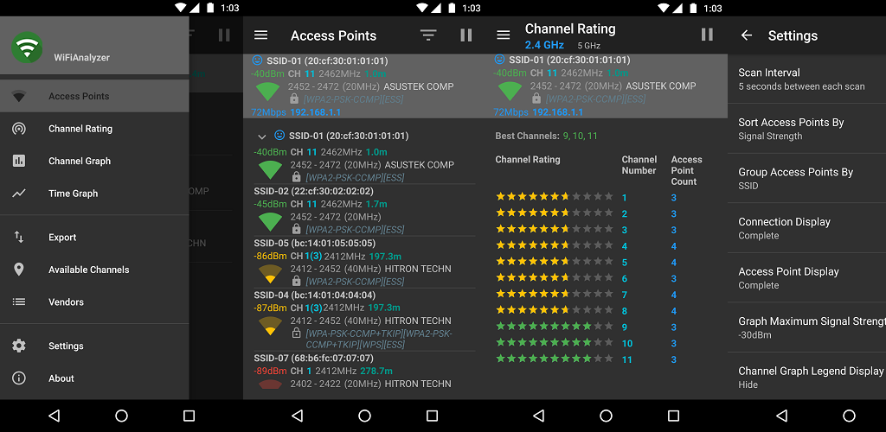
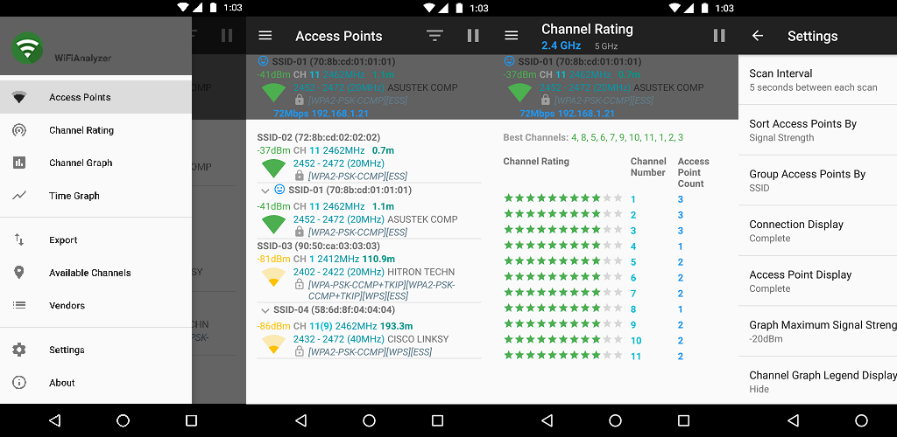

<h1>WiFi Analyzer </h1>

[](https://play.google.com/store/apps/details?id=com.vrem.wifianalyzer)
[](https://f-droid.org/repository/browse/?fdid=com.vrem.wifianalyzer)
[
](https://www.amazon.com/VREM-Software-Development-WiFiAnalyzer-open-source/dp/B06XZT7RYD)

This is the official repository of WiFi Analyzer.




## Table of Contents

- [Features](#features)
- [Usage Tips](#usage-tips)
- [How-to](#how-to)
- [FAQ](#faq)
- [Feedback](#feedback)
- [License](#license)
- [Privacy policy](#privacy-policy)
- [WiFi Analyzer Build](#wifi-analyzer-build)
- [Contribute](#contribute)

## Features

* Identify nearby Access Points
* Graph channels signal strength
* Graph Access Point signal strength over time
* Analyze WiFi networks to rate channels
* HT/VHT Detection - 40/80/160MHz (Requires Android OS 6+)
* 2.4 GHz, 5 GHz and 6 GHz WiFi bands (Requires hardware support)
* Access Point view complete or compact
* Estimated Distance to the Access Points
* Export access points details
* Dark, Light and System theme available
* Pause/Resume scanning
* Available filters: WiFi band, Signal strength, Security and SSID
* Vendor/OUI Database Lookup
* The application has too many features to mention them all

**Please note WiFi Analyzer is not a WiFi password cracking or phishing tool.**

## Usage Tips

* Tap the title bar to switch between 2.4, 5 and 6 GHz WiFi band.
* SSID with `***` or `*hidden*` means it is hidden.
* Access Point security:
    * WPA3(SAE)/WPA2/WPA
    * WEP/WPS
    * Disabled
* Wi-Fi Standard (Requires Android OS 11+):
    * 4 - 802.11n
    * 5 - 802.11ac
    * 6 - 802.11ax
    * 7 - 802.11be

## How-to

* [How to video](https://youtu.be/JJVKja0VDR0)
* [How to find the best 5Ghz WiFi Channel](https://www.maketecheasier.com/best-wifi-channel-for-5ghz-frequency/)
* [Understand Wi-Fi 4/5/6/6E/7 (802.11 n/ac/ax/be) - Make educated wireless router/AP upgrade decisions](https://www.duckware.com/tech/wifi-in-the-us.html)
* [Why Wi-Fi stinks and how to fix it](http://spectrum.ieee.org/telecom/wireless/why-wifi-stinksand-how-to-fix-it)
* [Wi-Fi channels list](https://en.wikipedia.org/wiki/List_of_WLAN_channels)
* [How is distance calculated to Access Point](https://en.wikipedia.org/wiki/Free-space_path_loss)

## FAQ

* [Android Wi-Fi scanning throttling](https://github.com/VREMSoftwareDevelopment/WiFiAnalyzer/wiki/Android-WiFi-scanning-throttling)
* [Location Service Permission Requirements](https://github.com/VREMSoftwareDevelopment/WiFiAnalyzer/wiki/Location-Service-Permission-Requirements)
* [WiFi Analyzer on secondary user accounts](https://github.com/VREMSoftwareDevelopment/WiFiAnalyzer/wiki/WiFi-Analyzer-on-secondary-user-accounts)
* [How channel graph displays 20/40/80/160 MHz channel width?](https://github.com/VREMSoftwareDevelopment/WiFiAnalyzer/issues/64)
* [How to use SSID filter?](https://github.com/VREMSoftwareDevelopment/WiFiAnalyzer/issues/125)
* [WiFi Analyzer equivalent on iOS](https://github.com/VREMSoftwareDevelopment/WiFiAnalyzer/issues/69)

## Feedback

* Bug reports can be submitted [here](https://github.com/VREMSoftwareDevelopment/WiFiAnalyzer/issues).
* To learn how to submit a bug [click here](https://github.com/VREMSoftwareDevelopment/WiFiAnalyzer/wiki/Feedback).
* [Discussions](https://github.com/VREMSoftwareDevelopment/WiFiAnalyzer/discussions)
* If you do not have GitHub account, please use [google groups](https://groups.google.com/forum/#!forum/wifi-analyzer-open-source) to discuss application features.

## License

[](http://www.gnu.org/licenses/gpl-3.0.html)

WiFi Analyzer is licensed under the GNU General Public License v3.0 (GPLv3).

### GPLv3 License key requirements:

* Disclose Source
* License and Copyright Notice
* Same License
* State Changes

[GNU General Public License v3.0 (GPLv3) Explained in Plain English](https://tldrlegal.com/license/gnu-general-public-license-v3-(gpl-3))

[GNU General Public License v3.0 (GPLv3)](http://www.gnu.org/licenses/gpl-3.0.html).

## Privacy policy

* WiFi Analyzer does not collect any personal/device information.
* WiFi Analyzer is designed to use as few permissions as possible. It asks for just enough to perform the analysis. 
* Plus, it is all open source so nothing is hidden! 
* Most notably, this application does not require access to internet, so you can be sure it does not send any personal/device information to any other source and it does not receive any information from other sources. 

## WiFi Analyzer Build

[](https://github.com/VREMSoftwareDevelopment/WiFiAnalyzer/actions?query=workflow%3A%22Android+CI%22)
[](https://app.codacy.com/gh/VREMSoftwareDevelopment/WiFiAnalyzer/dashboard?utm_source=gh&utm_medium=referral&utm_content=&utm_campaign=Badge_grade)
[](https://codecov.io/gh/VREMSoftwareDevelopment/WiFiAnalyzer)

[](https://snyk.io/test/github/vremsoftwaredevelopment/wifianalyzer)
[](https://app.fossa.io/projects/git%2Bgithub.com%2FVREMSoftwareDevelopment%2FWiFiAnalyzer?ref=badge_shield)

[](https://github.com/VREMSoftwareDevelopment/WiFiAnalyzer/issues)
[](https://github.com/VREMSoftwareDevelopment/WiFiAnalyzer/stargazers)
[](https://github.com/VREMSoftwareDevelopment/WiFiAnalyzer/network)

## Contribute

* Feel free to fork the project and submit your changes.
* To learn how to submit a pull request [click here](https://github.com/VREMSoftwareDevelopment/WiFiAnalyzer/wiki/Pull-Request).
* We want to express our gratitude to all [people](https://github.com/VREMSoftwareDevelopment/WiFiAnalyzer/graphs/contributors) for their contributions, such as: patches, bug solving, updates and etc.
* If you would like to contribute financially to the project please feel free to send any amount through paypal.
    * [](https://www.paypal.com/cgi-bin/webscr?cmd=_s-xclick&hosted_button_id=62PA6HJ3BZL3E)
    * Thanks to every one who already donated so far!

### Fork project

[How to fork project](https://help.github.com/articles/fork-a-repo)

### Build project

1. Install Android Studio
2. Import project into Android Studio
    * In Welcome to Android Studio Screen select Import project ...
    * Select the root directory of the WiFi Analyzer repository and click "OK".
    * WiFi Analyzer will build automatically.

### Running lint, unit tests and jacoco coverage report

```
./gradlew lintDebug jacocoTestCoverageVerification
```

- lint report: `app/build/reports/lint-results.html`
- unit test report: `app/build/reports/tests/testDebugUnitTest/index.html`
- code coverage report: `app/build/reports/jacoco/jacocoTestReport/html/index.html`
